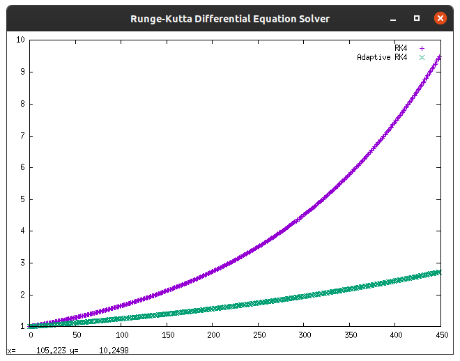

# Runge-Kutta 4th order differential equation solver

In numerical analysis, the [Runge–Kutta](https://en.wikipedia.org/wiki/Runge%E2%80%93Kutta_methods) methods are a family of implicit and explicit iterative methods, which include the well-known routine called the Euler Method, used in temporal discretization for the approximate solutions of ordinary differential equations.

### Prerequisites

GCC Compiler, Boost Library and a terminal

### Running

The project is supplied with a make file.

The following make commands are available:

	> make
	
	Compiles source and executes the program. Install any missing libs if prompted

	> make clean
	
	Cleans executable

## Results

The program runs RK 4th order method to calculate value of Euler's constant *e*.

Two methods are used namely:

- Generic RK method 

- Adaptive RK method

A graph is plotted for both the iteration cycles using gnuplot. 

The header file for the same is already provided in the project.

